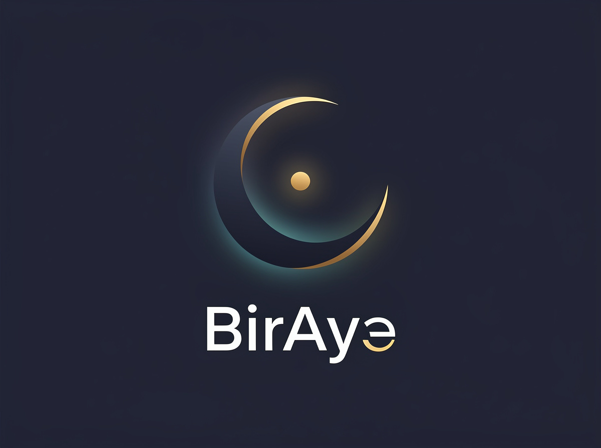

<p align="center">
  
</p>

<h1 align="center">BirAye &nbsp;<span dir="rtl">بِر آية</span></h1>

<p align="center"><em>bir ayet — “one verse.”  An evidence-based verbatim-memory engine for Quran Hifz — not a Quran reader.</em></p>

<p align="center"><strong>Doesn't help you read Quran. Stops you forgetting it — by attacking the exact ways huffaz actually fail.</strong></p>

<p align="center">
  <a href="https://github.com/tempoo04/biraye/actions/workflows/ci.yml"></a>
  <a href="https://github.com/tempoo04/biraye/actions/workflows/codeql.yml"></a>
  
  
  
  
</p>

---

BirAye is an evidence-based Quran memorization app. Where most apps are audio players
with a full mushaf, BirAye is built around the cognitive science of **verbatim sequence
memory** and traditional Hifz pedagogy: spaced review, deliberate scaffold withdrawal,
and similar-verse disambiguation.

## Why it's different

- **Three-tier spaced review** mirroring the classic *sabaq / sabqi / manzil* cycle, driven
  by an SM-2 / FSRS-lite scheduler tuned for verbatim recall — not flashcard facts.
- **Scaffold withdrawal** — audio and text support fade as a memory strengthens
  (`full → text → first-word → blind recall`), because research shows audio aids *encoding*
  but reduces retrieval difficulty at *review*.
- **Mutashabihat engine** — automatic contrastive drilling of mutually-similar verses, the
  #1 cause of Hifz errors and a gap in every existing app.
- **Teacher's logbook, not a replacement** — the human teacher stays the accuracy gate;
  the app schedules, tracks, and exports a log.
- **Repeat trainer** — loop any verse range with configurable per-ayah and whole-range
  repeats and adjustable playback speed.

## Tech

- **Backend:** Python / FastAPI + SQLite
- **Frontend:** responsive web (browser + installable PWA, phone-friendly)
- **Data:** open APIs — [alquran.cloud](https://alquran.cloud) for Uthmani text,
  Muhammad Asad translation, and Mishary Alafasy per-ayah audio — cached locally.

## Run it

```bash
pip install -r requirements.txt
cd src
python -m uvicorn biraye.app:app --reload
```

Open <http://127.0.0.1:8000>.

## Using BirAye

The app has five tabs: **Read**, **Drill**, **Similar**, **Review**, **Log**.
Switch language (English / Azerbaijani) from the toggle in the top-right corner.

### Read — browse and start memorizing
1. Pick a surah from the dropdown.
2. For each ayah you can:
   - **▶ Listen** — play the recitation.
   - **+ Memorize** — start tracking it (enters the *sabaq* queue for review).
   - **≈ Similar** — show mutashabihat (similar verses) with the differing words
     **highlighted in yellow** so you can learn to tell them apart.

### Drill — repeat trainer
Loop a range of verses to drum them in.
1. Choose a **Surah**, then a **From ayah** and **To ayah** (e.g. Al-Baqarah 7 → 20).
2. Set the loop counts — each button **cycles on every click**:
   - **Each ayah ×** — how many times each ayah repeats before moving on
     (`1 → 2 → 3 → 4 → 5 → 10 → ∞`).
   - **Whole range ×** — how many times the entire range repeats
     (`1 → 2 → 3 → 4 → 5 → 10 → ∞`).
   - **Speed** — playback tempo (`×0.5 → ×1 → ×1.5 → ×2`); can be changed live
     while a drill is playing.
3. Press **▶ Start drill**. A status line shows the current ayah, which repeat,
   and which pass you're on. **⏸ Pause** holds your place; **⏹ Stop** resets.

### Similar — the mutashabihat browser
Browse every pair of verses that are easy to confuse (computed automatically —
~1,400 pairs). Filter by surah, then tap any pair to expand the two verses
side by side with the **differing words highlighted**. This is the feature no
other app has — see [How the mutashabihat engine works](#how-the-mutashabihat-engine-works).

> Example: Baqarah 7→20, Each ayah ×5, Whole range ×∞, Speed ×1 — plays each verse
> five times, walks the whole range, then loops the range forever.

### Review — spaced recall with scaffold withdrawal
1. Memorized ayahs become due here over time. The **due badge** shows how many.
2. Each due ayah is a recall card. How much help you get depends on how strong the
   memory is (the *scaffold* level, shown in a note):
   - **full** — text shown, audio available
   - **text** — text only, audio withdrawn (recall the sound)
   - **first word** — only the first word shown
   - **blind** — nothing shown; recite from memory, then **Reveal ayah** to self-check
3. Recite, then rate honestly: **Again / Hard / Good / Easy**. This reschedules the ayah.
4. If the ayah has similar verses, a **⚠ contrast panel** appears so you drill the
   difference while it's fresh.
5. The **"Review as of"** date picker lets you jump to a future day to see what would be
   due — handy for trying the scheduler without waiting.

### Log — the teacher's logbook
A table of every tracked ayah (tier, repetitions, lapses, last review, due date).
Press **Export CSV** to download it and share with a teacher.

### Install on your phone (PWA)
BirAye is a Progressive Web App. In a mobile browser (or desktop Chrome) use
**Add to Home Screen** / the install icon to run it like a native app; it works
offline after the first load. (Installation requires `https://` or `localhost` —
plain `http://` over a local network won't enable it.)

## API

| Method | Endpoint | Purpose |
|--------|----------|---------|
| `GET`  | `/api/health` | liveness |
| `GET`  | `/api/surahs` | list all 114 surahs |
| `GET`  | `/api/surah/{n}` | one surah: text + translation + audio |
| `POST` | `/api/memorize` | start tracking an ayah |
| `POST` | `/api/review` | rate recall, reschedule |
| `GET`  | `/api/queue?as_of=YYYY-MM-DD` | due ayahs by tier |
| `GET`  | `/api/progress` | counts per tier |
| `GET`  | `/api/similar/{s}/{a}` | similar verses with contrastive diffs |
| `GET`  | `/api/mutashabihat` | all unique similar-verse pairs |
| `GET`  | `/api/log` | full logbook of tracked ayahs |

## How the mutashabihat engine works

*Mutashabihat* (المتشابهات) are mutually-similar verses — near-identical wording that
differs by a word, particle, or order. They are the **#1 cause of Hifz errors**: the
memory pattern-matches the shared part and "jumps the track" onto the wrong verse.
Traditional teachers drill these pairs side by side; no mainstream app does.

BirAye builds the similar-verse graph **algorithmically from the Quran text** — no
curated dataset:

1. **Normalize** each ayah — strip diacritics/tatweel and fold letter variants
   (`أ إ آ ٱ → ا`, `ة → ه`, …) so comparison is on essence, not spelling.
2. **Candidate gate** — index every shared 4-word phrase; two verses are candidates
   only if they share one. (Cheap; throws away unrelated pairs.)
3. **Score** candidates by token-sequence similarity; keep pairs ≥ 55% alike.
4. **Diff** each pair both ways and flag the differing words for highlighting.

The graph (~1,400 pairs over 6,236 ayahs) is computed once and cached. The **Similar**
tab lets you browse it; in **Review**, twins surface automatically beside a due ayah.

## Status

Built milestone-by-milestone — see [ROADMAP.md](ROADMAP.md). Done: M0–M6
(skeleton, read+listen, three-tier scheduler, scaffold-withdrawal recall,
mutashabihat engine, PWA + teacher logbook, repeat trainer), the similar-verse
browser, and English/Azerbaijani localization — plus CI / CodeQL / Dependabot /
pre-commit and a test suite.

> ⚠️ **Alpha.** In testing with early users. Data is per-device for now; accounts,
> cloud sync, and a persistent database are planned.
